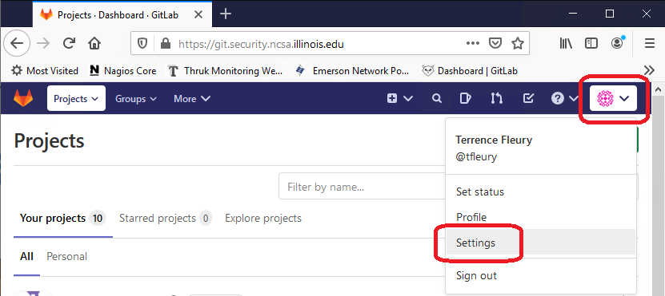
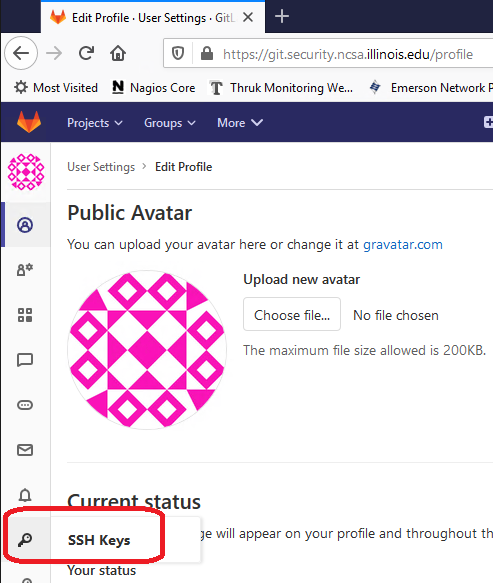
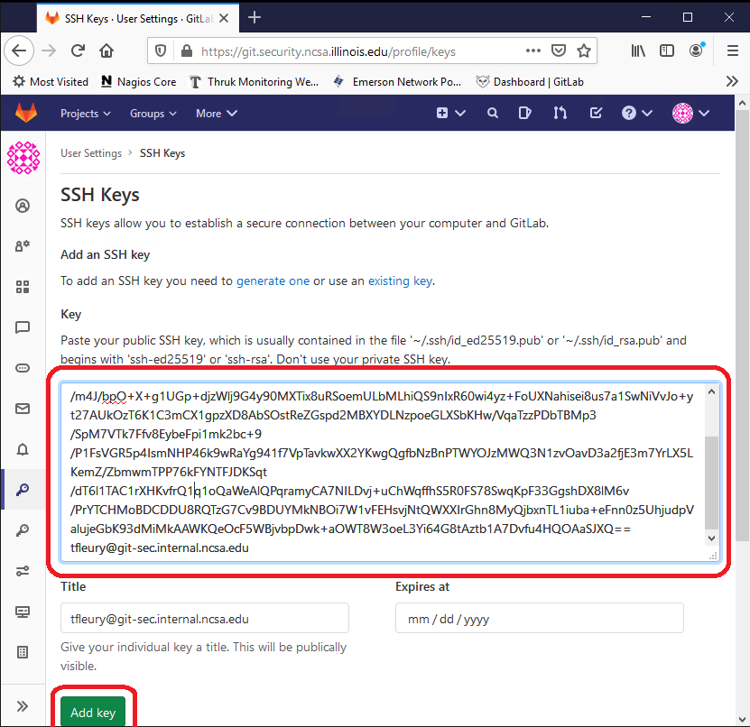

## GitLab Setup

These instructions help configure cadocker1/2/-dev to check out files from
the [NCSA Security Operations GitLab
server](https://git.security.ncsa.illinois.edu/cisr/ncsa-shib-idp).
Much of the documentation here was gleaned from [Working with
GitLab](https://wiki.ncsa.illinois.edu/display/PKI/Working+with+Gitlab) and
[Working with the Puppet Git
Repo](https://wiki.ncsa.illinois.edu/display/CSD/Working+with+the+Puppet+GIT+Repo).

First, create the `~/.ssh` directory and `~/.ssh/config` file with the
correct permissions.

```
mkdir -m 700 ~/.ssh
touch ~/.ssh/config
chmod 600 ~/.ssh/config
```

Create a new SSH key pair to be used for git SSH access to the GitLab server.

```
ssh-keygen -f ~/.ssh/csnd_gitsec
```

Ensure the following lines appear in ~/.ssh/config :

```
ControlMaster auto
ControlPersist yes
ControlPath ~/.ssh/master-%r@%h:%p
 
Host git.security.ncsa.illinois.edu
  User git
  Proxycommand ssh -T bastion1.security.ncsa.illinois.edu -W %h:%p
  IdentityFile ~/.ssh/csnd_gitsec
```

Use an RDP client to connect to `sects01.ncsa.illinois.edu`. Launch a web
browser and navigate to <https://git.security.ncsa.illinois.edu>. Log in with
your NCSA username and password. Click on your profile icon in the upper
right corner and select "Settings".



From the left column, select the "SSH Keys" icon.



Copy the text contents of the `~/.ssh/csnd_gitsec.pub` file and paste it
into the "Key" text box. Then click the "Add key" button.



## Clone the GitLab Repository

Next, create the `/opt/ncsa-shib-idp` directory with correct ownership and
clone the git repository.

```
sudo mkdir /opt/ncsa-shib-idp
sudo chown $USER:docker /opt/ncsa-shib-idp
git clone git@git.security.ncsa.illinois.edu:cisr/ncsa-shib-idp.git /opt/ncsa-shib-idp
    Cloning into '/opt/ncsa-shib-idp'...
    Password: <NCSA Kerberos password>
    Duo two-factor login for tfleury
     
    Enter a passcode or select one of the following options:
 
    1. Duo Push to XXX-XXX-6551
 
    Passcode or option (1-1): 1
    Enter passphrase for key '/home/tfleury/.ssh/csnd_gitsec': <Passphrase for your SSH key>
    remote: Enumerating objects: 40, done.
    remote: Counting objects: 100% (40/40), done.
    remote: Compressing objects: 100% (35/35), done.
    remote: Total 40 (delta 7), reused 0 (delta 0), pack-reused 0
    Receiving objects: 100% (40/40), 146.29 KiB | 0 bytes/s, done.
    Resolving deltas: 100% (7/7), done.
 
sudo chown -R root:docker /opt/ncsa-shib-idp
cd /opt/ncsa-shib-idp
sudo sh fixperms.sh
```

## Run the Container for the IdP

```
cd /opt/ncsa-shib-idp

# Start the container
sh run.sh

# Monitor container startup
sh logs.sh
```

## (Optional) Break into the Running Container

```
sh inspect.sh
```

